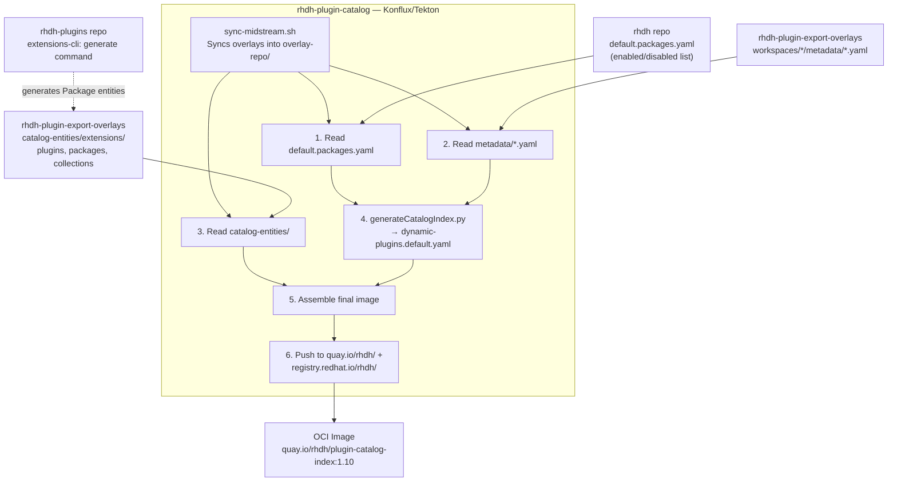
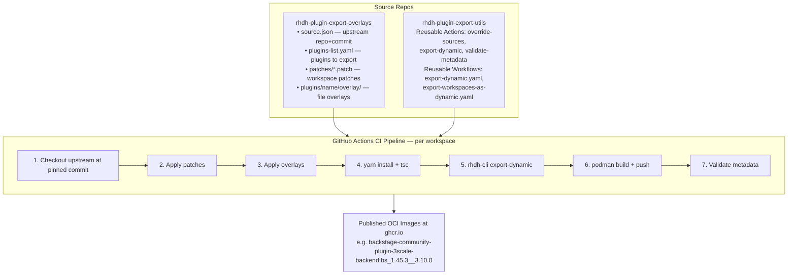
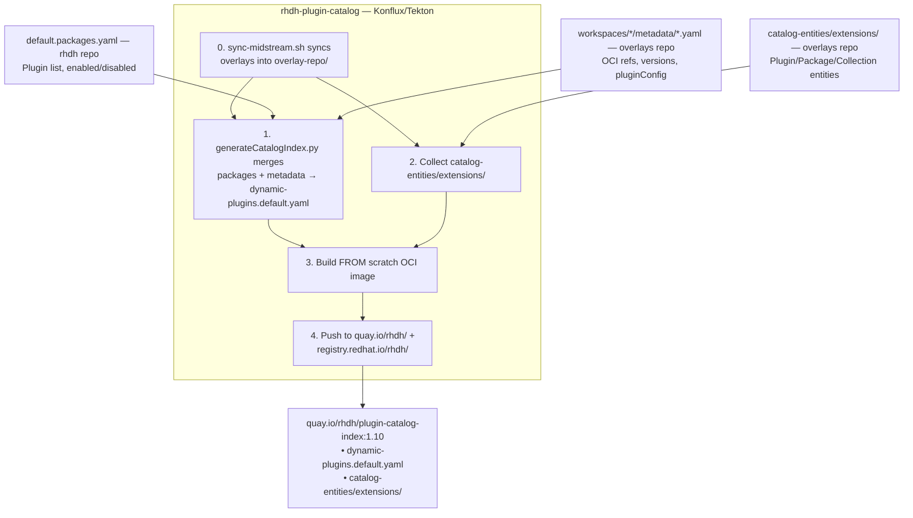
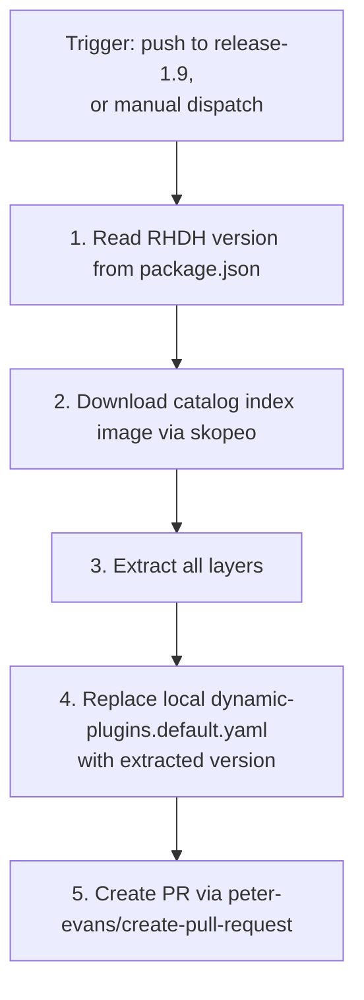
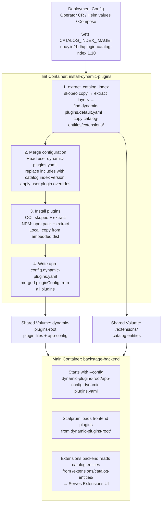

# Catalog Index Image: Build Process and Architecture

This document explains how the `plugin-catalog-index` OCI image is built, what feeds into it, and how it is consumed across the RHDH ecosystem.

## What is the Catalog Index Image?

The catalog index image (`quay.io/rhdh/plugin-catalog-index:<version>`) is a minimal `FROM scratch` OCI image that serves as a **distribution mechanism** for two things:

1. **Default plugin configurations** (`dynamic-plugins.default.yaml`) — the master list of all available dynamic plugins, their OCI image references, default enabled/disabled state, and default `pluginConfig`
2. **Extensions catalog entities** (`catalog-entities/extensions/`) — Backstage catalog YAML files (kind `Plugin` and `Package`) that power the RHDH Extensions UI

By packaging these as a standalone OCI image, the default plugin list and catalog metadata can be updated **independently** of the main RHDH container image.

## Image Contents

```
/ (image root, FROM scratch)
├── dynamic-plugins.default.yaml       # Master plugin configuration
└── catalog-entities/
    └── extensions/
        ├── plugins/
        │   ├── all.yaml               # Location entity listing all plugins
        │   ├── 3scale.yaml            # Plugin entity (UI metadata, description, icon)
        │   ├── argocd.yaml
        │   └── ...
        ├── packages/                  # Generated at build time by extensions-cli
        │   ├── all.yaml               # Location entity listing all packages
        │   ├── backstage-community-plugin-3scale-backend.yaml  # Package entity (OCI ref, version)
        │   └── ...
        └── collections/
            ├── all.yaml               # Location entity listing all collections
            ├── featured.yaml          # PluginCollection entities (curated groupings)
            ├── recommended.yaml
            └── ...
```

> **Note:** The `packages/` directory does not exist in the source repositories — it is generated at build time by the `extensions-cli generate` command from `dynamic-plugins.default.yaml`. The `plugins/` and `collections/` directories are maintained in the `rhdh-plugin-export-overlays` repo.

## Build Pipeline Overview

The catalog index image is assembled from multiple input sources spread across multiple repositories. Community plugins are built in the **`rhdh-plugin-export-overlays`** repository via GitHub Actions, while Tech Preview (TP) and Generally Available (GA) plugins are built in Red Hat's internal CI infrastructure (Konflux/Tekton) via the **`rhdh-plugin-catalog`** midstream repository. The catalog index image itself is always assembled in `rhdh-plugin-catalog`, but all source content is produced in the public repositories.



## Input Sources in Detail

### 1. `default.packages.yaml` (rhdh repo)

**Path:** `rhdh/default.packages.yaml`

This is the **master manifest** declaring which plugins are part of RHDH and their default enabled/disabled state. It contains two lists:

```yaml
packages:
  enabled:
    - package: '@backstage/plugin-techdocs'
    - package: '@red-hat-developer-hub/backstage-plugin-extensions'
    # ... plugins enabled by default
  disabled:
    - package: '@backstage-community/plugin-3scale-backend'
    - package: '@backstage/plugin-kubernetes'
    # ... plugins available but disabled by default
```

This file drives which plugins appear in the generated `dynamic-plugins.default.yaml`. The package names here correspond to npm packages that have been exported as dynamic plugins (either embedded in the RHDH image or published as OCI images).

### 2. Per-Plugin Metadata (rhdh-plugin-export-overlays repo)

**Path:** `rhdh-plugin-export-overlays/workspaces/*/metadata/*.yaml`

Each plugin workspace in the overlays repo has a `metadata/` directory containing one YAML file per exported plugin package. These files follow the `extensions.backstage.io/v1alpha1` `Package` kind:

```yaml
apiVersion: extensions.backstage.io/v1alpha1
kind: Package
metadata:
  name: backstage-community-plugin-3scale-backend
  namespace: rhdh
  title: "3Scale"
spec:
  packageName: "@backstage-community/plugin-3scale-backend"
  dynamicArtifact: oci://ghcr.io/redhat-developer/rhdh-plugin-export-overlays/backstage-community-plugin-3scale-backend:bs_1.45.3__3.10.0!backstage-community-plugin-3scale-backend
  version: 3.10.0
  backstage:
    role: backend-plugin
    supportedVersions: 1.45.3
  author: Red Hat
  support: community
  lifecycle: active
```

These metadata files contain the OCI image references, version information, and Backstage compatibility data. They are validated by the `validate-metadata` action during the plugin export CI pipeline.

### 3. Extensions Catalog Entities (rhdh-plugin-export-overlays repo)

**Path:** `rhdh-plugin-export-overlays/catalog-entities/extensions/`

This directory contains the Backstage catalog entities that power the RHDH Extensions UI:

- **`plugins/*.yaml`** — `Plugin` kind entities containing user-facing metadata: title, description, icon, categories, highlights, documentation, and links to constituent packages
- **`packages/*.yaml`** — `Package` kind entities generated from `dynamic-plugins.default.yaml` using the `extensions-cli generate` command; contain OCI artifact references and version info
- **`collections/*.yaml`** — `PluginCollection` kind entities: curated groupings of plugins (e.g., "featured", "recommended", "CI/CD", "OpenShift")

The `all.yaml` files in each subdirectory are Backstage `Location` entities that enumerate all entities for catalog ingestion.

### 4. Extensions CLI (rhdh-plugins repo)

**Path:** `rhdh-plugins/workspaces/extensions/packages/cli/`

The `@red-hat-developer-hub/extensions-cli` provides a `generate` command that creates `Package` entity YAML files from a `dynamic-plugins.default.yaml`:

```bash
npx @red-hat-developer-hub/extensions-cli generate \
  --namespace rhdh \
  -p dynamic-plugins.default.yaml \
  -o catalog-entities/extensions/packages
```

This command:
1. Reads the `dynamic-plugins.default.yaml` file
2. For each plugin entry, resolves the wrapper directory and reads `package.json`
3. Extracts metadata: npm package name, version, author, links, backstage role, keywords
4. Generates a `Package` entity YAML file per plugin
5. Creates an `all.yaml` Location entity referencing all generated files

## Individual Plugin Image Build Pipeline

While the catalog index image is a *manifest*, the individual plugin OCI images it references are built by separate pipelines. **Community plugins** are built via GitHub Actions in the `rhdh-plugin-export-overlays` repository and published to `ghcr.io`. **Tech Preview (TP) and Generally Available (GA) plugins** are built via Konflux/Tekton pipelines in `rhdh-plugin-catalog` and published to `quay.io/rhdh/` and `registry.redhat.io/rhdh/`.

The community plugin build pipeline works as follows:



### Per-Workspace Build Steps

For each workspace (e.g., `workspaces/3scale/`):

1. **Source Resolution**: Read `source.json` to get the upstream repo URL and pinned commit SHA
2. **Checkout**: Clone the upstream plugin repo at the pinned commit
3. **Override Sources**: Apply workspace-level `.patch` files (sorted alphabetically, auto-detects `-p0`/`-p1`), then copy per-plugin overlay files into the source tree
4. **Build**: `yarn install --immutable` + `yarn tsc` to ensure the workspace compiles
5. **Export**: For each plugin listed in `plugins-list.yaml`, run `rhdh-cli export-dynamic` which produces:
   - Backend plugins: `dist-dynamic/` directory with production dependencies
   - Frontend plugins: `dist-scalprum/` directory with webpack module federation assets
6. **Package & Push**: Build a `FROM scratch` OCI image containing the plugin files and push to `ghcr.io`
7. **Validate Metadata**: Run `validate-metadata` to ensure `metadata/*.yaml` files are consistent with the published images

### Image Tag Convention

Plugin OCI images use the tag format: `bs_<backstage_version>__<plugin_version>`

Example: `backstage-community-plugin-3scale-backend:bs_1.45.3__3.10.0`

This encodes both the Backstage version the plugin was built against and the plugin's own version.

## Catalog Index Assembly (`rhdh-plugin-catalog`)

The final catalog index image is built via the **`rhdh-plugin-catalog`** midstream repository using Konflux/Tekton pipelines. This repo:

- Syncs content from `rhdh-plugin-export-overlays` via `build/ci/sync-midstream.sh`
- Builds TP and GA plugin OCI images via 56 Tekton PipelineRun definitions in `.tekton/` (each plugin has a dedicated pipeline triggered by changes to its workspace directory)
- Generates the catalog index via `build/scripts/generateCatalogIndex.py`
- Publishes to both `quay.io/rhdh/` and `registry.redhat.io/rhdh/`



## Sync Back to RHDH Repo

> **Note:** As of RHDH 1.10/main, the `dynamic-plugins.default.yaml` file has been **removed from the main branch** (RHIDP-9863) and the sync workflow is disabled for main. The file is only maintained on the `release-1.9` branch. In 1.10+, the catalog index image is the **sole source** of `dynamic-plugins.default.yaml` at runtime — the init container extracts it directly from the image. The sync workflow below only applies to the 1.9 branch.

A GitHub Actions workflow keeps the RHDH repo's `dynamic-plugins.default.yaml` in sync with the latest catalog index image on the `release-1.9` branch:



This ensures that `dynamic-plugins.default.yaml` in the RHDH 1.9 branch stays consistent with the published catalog index image.

## Consumption Flow at Runtime

Once the catalog index image is published, here is how it flows through to a running RHDH instance. See also [Dynamic Plugin Loading](dynamic-plugin-loading.md) for detailed runtime behavior.



## Deployment-Specific Configuration

### Operator

In `rhdh-operator/config/profile/rhdh/default-config/deployment.yaml`, the `CATALOG_INDEX_IMAGE` env var is set directly on the `install-dynamic-plugins` init container:

```yaml
# CATALOG_INDEX_IMAGE will be replaced by the value of the `RELATED_IMAGE_catalog_index` env var, if set
- name: CATALOG_INDEX_IMAGE
  value: "quay.io/rhdh/plugin-catalog-index:1.9"
- name: CATALOG_ENTITIES_EXTRACT_DIR
  value: '/extensions'
```

When deployed via OLM (Operator Lifecycle Manager), the `RELATED_IMAGE_catalog_index` env var on the operator pod automatically overrides this value through OLM's standard `RELATED_IMAGE_*` substitution mechanism. Users can further override it via the Backstage CR's `extraEnvs` or a deployment patch, both of which take precedence over the default and OLM-injected values.

### Helm Chart

In `rhdh-chart/charts/backstage/values.yaml`:
```yaml
global:
  catalogIndex:
    image:
      registry: quay.io
      repository: rhdh/plugin-catalog-index
      tag: "1.10"
```

### Docker Compose (rhdh-local)

Set via `.env` file or `environment:` block in `compose.yaml`.

## Version Alignment

The catalog index image version is aligned with the RHDH release version. Each RHDH release has a corresponding catalog index tag:

| RHDH Version | Catalog Index Image Tag | Backstage Version |
|---|---|---|
| 1.10 | `plugin-catalog-index:1.10` | 1.45.x |
| 1.9 | `plugin-catalog-index:1.9` | 1.42.x |

The `versions.json` in the overlays repo pins the exact Backstage version and CLI version used to build the plugins:

```json
{
    "backstage": "1.45.3",
    "node": "22.19.0",
    "cli": "1.9.1",
    "cliPackage": "@red-hat-developer-hub/cli"
}
```

## Repository Roles Summary

| Repository | Role in Catalog Index Pipeline |
|---|---|
| **rhdh** | Defines `default.packages.yaml` (which plugins, enabled/disabled). Contains the `install-dynamic-plugins.py` consumer script. Has sync workflow to pull latest `dynamic-plugins.default.yaml` from the published image (active on `release-1.9` only; disabled for main/1.10+). |
| **rhdh-plugin-export-overlays** | Contains per-plugin metadata (`workspaces/*/metadata/*.yaml`), catalog entities (`catalog-entities/extensions/`), and CI workflows that build individual plugin OCI images. Source-of-truth for plugin descriptions, icons, and UI metadata. |
| **rhdh-plugin-export-utils** | Provides reusable GitHub Actions and workflows used by the overlays repo: `override-sources`, `export-dynamic`, `validate-metadata`, and orchestration workflows. |
| **rhdh-cli** | Provides `export-dynamic` command that packages plugins into `dist-dynamic/` or `dist-scalprum/` directories, and `package-dynamic-plugins` command that builds `FROM scratch` OCI images. |
| **rhdh-plugins** | Houses the `extensions-cli` (`generate` command) that produces `Package` entity YAML files from `dynamic-plugins.default.yaml`. Also contains the extensions frontend/backend plugins that consume catalog entities at runtime. |
| **rhdh-plugin-catalog** | Midstream infrastructure repo. Syncs plugin source from `rhdh-plugin-export-overlays` via `sync-midstream.sh`. Builds plugins via Konflux/Tekton pipelines (56 PipelineRun definitions in `.tekton/`). Generates catalog index via `generateCatalogIndex.py`. Publishes to `quay.io/rhdh/` and `registry.redhat.io/rhdh/`. Contains `plugin_builds/` metadata and 23 plugin workspace directories. |
| **rhdh-operator** | Sets `CATALOG_INDEX_IMAGE` in default deployment template. OLM's `RELATED_IMAGE_catalog_index` substitution overrides it at deploy time. |
| **rhdh-chart** | Configures `CATALOG_INDEX_IMAGE` via `global.catalogIndex.image` Helm values. |
| **rhdh-local** | Docker Compose local dev environment with 2 services (`rhdh`, `install-dynamic-plugins`) and a shared `dynamic-plugins-root` volume. Uses init container pattern. Supports four plugin sources: local directory (`local-plugins/`), OCI image (`oci://`), tarball URL, and pre-bundled plugins. |

## Key Files Reference

| File | Repository | Purpose |
|------|------------|---------|
| `default.packages.yaml` | rhdh | Master plugin enable/disable manifest |
| `dynamic-plugins.default.yaml` | rhdh (generated, `release-1.9` only) | Synced copy from catalog index image. Removed from main branch in 1.10+ (RHIDP-9863). |
| `.github/workflows/update-dynamic-plugins-default.yaml` | rhdh | Sync workflow (disabled for main in 1.10+, active on `release-1.9` only) |
| `scripts/install-dynamic-plugins/install-dynamic-plugins.py` | rhdh | Runtime catalog index extraction logic |
| `workspaces/*/metadata/*.yaml` | rhdh-plugin-export-overlays | Per-plugin Package metadata |
| `workspaces/*/source.json` | rhdh-plugin-export-overlays | Upstream repo + commit pin |
| `workspaces/*/plugins-list.yaml` | rhdh-plugin-export-overlays | Plugins to export per workspace |
| `catalog-entities/extensions/plugins/*.yaml` | rhdh-plugin-export-overlays | Plugin entities for Extensions UI |
| `catalog-entities/extensions/packages/*.yaml` | rhdh-plugin-export-overlays | Package entities (generated) |
| `catalog-entities/extensions/collections/*.yaml` | rhdh-plugin-export-overlays | Plugin collection groupings |
| `versions.json` | rhdh-plugin-export-overlays | Backstage/Node/CLI version pins |
| `.github/workflows/export-dynamic.yaml` | rhdh-plugin-export-utils | Reusable per-workspace export workflow |
| `workspaces/extensions/packages/cli/` | rhdh-plugins | Extensions CLI (`generate` command) |
| `build/scripts/generateCatalogIndex.py` | rhdh-plugin-catalog | Generates catalog index from synced content |
| `build/scripts/generatePluginBuildInfo.py` | rhdh-plugin-catalog | Generates per-plugin build metadata |
| `build/ci/sync-midstream.sh` | rhdh-plugin-catalog | Syncs overlay content from `rhdh-plugin-export-overlays` |
| `catalog-index/index.json` | rhdh-plugin-catalog | Master catalog of all plugins |
| `.tekton/*.yaml` | rhdh-plugin-catalog | 56 Konflux PipelineRun definitions for plugin builds |
| `plugin_builds/<plugin>/*.json` | rhdh-plugin-catalog | Per-plugin build metadata (versions, image refs) |
| `config/profile/rhdh/default-config/deployment.yaml` | rhdh-operator | Default deployment template with `CATALOG_INDEX_IMAGE` |
| `charts/backstage/values.yaml` | rhdh-chart | `global.catalogIndex.image` config |
