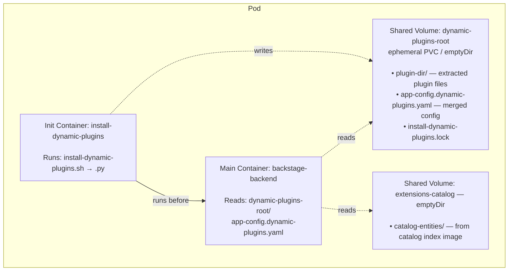
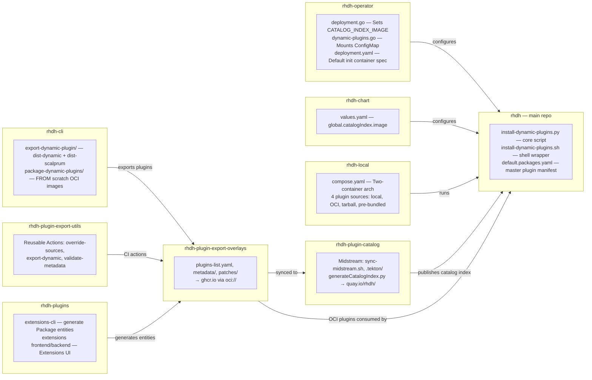

# Dynamic Plugin Loading Architecture

This document explains how dynamic plugins are loaded into RHDH at runtime, how the catalog index image is used, and how the `install-dynamic-plugins.py` script orchestrates the process.

## Architecture Overview

Dynamic plugin loading follows an **init container pattern**: a dedicated `install-dynamic-plugins` init container runs before the main RHDH backend starts, downloading, extracting, and configuring plugins into a shared volume.



## The `install-dynamic-plugins.py` Script

The script at `scripts/install-dynamic-plugins/install-dynamic-plugins.py` is the core engine. It is copied into the RHDH container image during the build (`build/containerfiles/Containerfile`) and invoked by the shell wrapper `install-dynamic-plugins.sh`.

### Step 1: Locking

Creates a file lock (`install-dynamic-plugins.lock`) in the `dynamic-plugins-root` directory to prevent concurrent installations. This is important when multiple pods share a persistent volume. Uses `atexit` to clean up the lock on exit. If a lock already exists, it polls every second until released.

If the init container is killed with `SIGKILL` (e.g., OOM, pod eviction), the lock file will not be cleaned up and must be removed manually. See [installing-plugins.md](../dynamic-plugins/installing-plugins.md#storage-of-dynamic-plugins) for details.

### Step 2: Catalog Index Image Extraction

If the `CATALOG_INDEX_IMAGE` environment variable is set, the script calls `extract_catalog_index()`, which:

1. Uses **skopeo** to download the OCI image to a temporary directory
2. Reads the `manifest.json` and extracts all layers
3. Looks for a `dynamic-plugins.default.yaml` file inside the extracted content
4. Extracts catalog entities from `catalog-entities/extensions/` (or `catalog-entities/marketplace/` for backward compatibility) into the directory specified by `CATALOG_ENTITIES_EXTRACT_DIR` (defaults to `/tmp/extensions/catalog-entities`)
5. Returns the path to the extracted `dynamic-plugins.default.yaml`

### Step 3: Configuration Merging

Reads `dynamic-plugins.yaml` which has two sections:

- **`includes`**: list of YAML files to load as base defaults (typically `dynamic-plugins.default.yaml`)
- **`plugins`**: user-defined plugin overrides

**Catalog index integration**: If the catalog index was extracted, the script **replaces** `dynamic-plugins.default.yaml` in the `includes` list with the file extracted from the catalog index image. This is how the catalog index overrides the embedded defaults.

Plugins are merged in two passes:

- **Level 0**: All plugins from `includes` files
- **Level 1**: All plugins from the main `plugins` list (overrides level 0)

Duplicate detection prevents the same plugin from being defined twice at the same level.

Two merger classes handle plugin key generation:

- **`NPMPackageMerger`**: Strips version info from package names to create stable keys (e.g., `@scope/pkg@1.0` becomes `@scope/pkg`). Also handles aliases, git URLs, and GitHub shorthand.
- **`OciPackageMerger`**: Strips the tag/digest to create keys like `oci://registry/image:!plugin-path`. Supports `{{inherit}}` to inherit version from included configs, and auto-detection of plugin paths from the `io.backstage.dynamic-packages` OCI annotation.

### Step 4: Plugin Installation

For each enabled plugin, the script creates a SHA-256 hash of the plugin configuration (excluding `pluginConfig` and `version`) for change detection. Then it iterates through all plugins and installs them.

#### Package Types and Installers

| Type | Prefix/Format | Installer Class | Tool Used |
|------|---------------|-----------------|-----------|
| OCI images | `oci://registry/image:tag!path` | `OciPluginInstaller` | `skopeo copy` then extract layer tarball. Images built by `rhdh-cli plugin package` as `FROM scratch` containers containing `dist-dynamic/` (backend) or `dist-scalprum/` (frontend) |
| NPM packages | `@scope/pkg@version` | `NpmPluginInstaller` | `npm pack` then extract `.tgz` |
| Local packages | `./path/to/plugin` | `NpmPluginInstaller` | `npm pack` from local path |

#### Pull Policies

- **`IfNotPresent`** (default): Skip download if hash file matches the current configuration
- **`Always`** (default for OCI packages with `:latest!`): Check remote digest against the stored `dynamic-plugin-image.hash` file; only re-download if the digest has changed

#### OCI Download Flow

The `OciDownloader` class handles OCI image downloads:

1. `skopeo copy docker://registry/image dir:/tmp/...` — downloads image layers to a local directory
2. Reads `manifest.json` to get the first layer's digest and locate the tarball
3. Extracts only the plugin subdirectory from the tarball into `dynamic-plugins-root/`
4. Saves the image digest to `dynamic-plugin-image.hash` for future comparison
5. Caches downloaded tarballs so that multiple plugins from the same image avoid redundant downloads

#### Registry Fallback

Plugin OCI images are published to multiple registries by `rhdh-plugin-catalog`: `quay.io/rhdh/` (community/upstream) and `registry.redhat.io/rhdh/` (Red Hat product). For images from `registry.access.redhat.com/rhdh/`, if the image doesn't exist there, the script falls back to `quay.io/rhdh/`. This is checked via `skopeo inspect`.

### Step 5: Config Output

Merges all `pluginConfig` fragments from enabled plugins into a single `app-config.dynamic-plugins.yaml` file in the `dynamic-plugins-root` directory. The backstage-backend container is started with `--config dynamic-plugins-root/app-config.dynamic-plugins.yaml` to load this merged config.

If two plugins define conflicting values for the same config key, an `InstallException` is raised.

### Step 6: Cleanup

Removes any plugin directories that were previously installed but are no longer in the current configuration. Detection uses hash file tracking: plugins whose hashes are still in `plugin_path_by_hash` after installation have been removed from the config.

## Environment Variables

| Variable | Description | Default |
|----------|-------------|---------|
| `CATALOG_INDEX_IMAGE` | OCI image reference for the plugin catalog index | Not set |
| `CATALOG_ENTITIES_EXTRACT_DIR` | Directory for extracting catalog entities | `/tmp/extensions` |
| `MAX_ENTRY_SIZE` | Maximum size of a file in an archive (zip bomb protection) | `20000000` (20MB) |
| `SKIP_INTEGRITY_CHECK` | Set to `"true"` to skip integrity check of remote NPM packages | Not set |
| `REGISTRY_AUTH_FILE` | Path to container registry auth config for private OCI registries | Not set |
| `NPM_CONFIG_USERCONFIG` | Path to `.npmrc` for custom NPM registry configuration | Not set |

## Catalog Index Image

### What It Contains

The catalog index image (e.g., `quay.io/rhdh/plugin-catalog-index:1.10`) is an OCI `FROM scratch` image containing:

```
/ (image root)
├── dynamic-plugins.default.yaml    # Default plugin configurations
└── catalog-entities/
    └── extensions/                 # (or marketplace/ for backward compat)
        ├── plugin-a.yaml           # Backstage catalog entities
        ├── plugin-b.yaml           # for the Extensions UI
        └── ...
```

### Purpose

The catalog index image **decouples the default plugin list from the RHDH container image**. This allows updating which plugins are available (and their default configs) without rebuilding the RHDH image itself.

The `dynamic-plugins.default.yaml` inside the catalog index replaces the one embedded in the RHDH container image when the catalog index is configured.

The catalog entities extracted to `/extensions/catalog-entities/` are consumed by the **extensions backend plugin**, which serves them in the RHDH Extensions UI (a marketplace-like view for browsing available plugins).

### How It Is Configured Across Deployment Methods

| Deployment Method | How `CATALOG_INDEX_IMAGE` Is Set |
|---|---|
| **Operator** (`rhdh-operator`) | `RELATED_IMAGE_catalog_index` env var on the operator pod is injected as `CATALOG_INDEX_IMAGE` on the init container (`pkg/model/deployment.go`). Default in `config/profile/rhdh/default-config/deployment.yaml`: `quay.io/rhdh/plugin-catalog-index:1.9` |
| **Helm chart** (`rhdh-chart`) | `global.catalogIndex.image.{registry,repository,tag}` in `values.yaml` is rendered into the init container's env vars |
| **Docker Compose** (`rhdh-local`) | Set via `.env` file or `environment:` block in `compose.yaml` |

### Operator-Specific Behavior

In the operator (`rhdh-operator/pkg/model/deployment.go:115-120`), the `RELATED_IMAGE_catalog_index` env var is read at reconciliation time and injected into the `install-dynamic-plugins` init container **before** user-specified `extraEnvs` are applied. This allows users to override the catalog index image via the Backstage CR's `extraEnvs`.

## Cross-Repository Relationships



## Key Files Reference

| File | Repository | Purpose |
|------|------------|---------|
| `scripts/install-dynamic-plugins/install-dynamic-plugins.py` | rhdh | Core plugin installation script |
| `scripts/install-dynamic-plugins/install-dynamic-plugins.sh` | rhdh | Shell wrapper for the Python script |
| `build/containerfiles/Containerfile` | rhdh | Copies the scripts into the RHDH container image |
| `dynamic-plugins.default.yaml` | rhdh | Embedded default plugin configurations |
| `pkg/model/dynamic-plugins.go` | rhdh-operator | Operator logic for init container and ConfigMap mounting |
| `pkg/model/deployment.go` | rhdh-operator | Operator logic for `CATALOG_INDEX_IMAGE` injection |
| `config/profile/rhdh/default-config/deployment.yaml` | rhdh-operator | Default deployment manifest with init container spec |
| `charts/backstage/values.yaml` | rhdh-chart | Helm values including `global.catalogIndex.image` |
| `compose.yaml` | rhdh-local | Docker Compose two-container setup |
| `prepare-and-install-dynamic-plugins.sh` | rhdh-local | Entrypoint wrapper for the init container in Compose |
| `src/commands/export-dynamic-plugin/` | rhdh-cli | Exports plugins to `dist-dynamic/` (backend) or `dist-scalprum/` (frontend) |
| `src/commands/package-dynamic-plugins/` | rhdh-cli | Packages exported plugins as `FROM scratch` OCI images |
| `build/scripts/generateCatalogIndex.py` | rhdh-plugin-catalog | Generates catalog index from synced overlay content |
| `build/ci/sync-midstream.sh` | rhdh-plugin-catalog | Syncs overlay content for midstream builds |
| `.tekton/*.yaml` | rhdh-plugin-catalog | 114+ Konflux PipelineRun definitions for plugin builds |
| `workspaces/extensions/packages/cli/` | rhdh-plugins | Extensions CLI (`generate` command for Package entities) |
| `.github/workflows/export-dynamic.yaml` | rhdh-plugin-export-utils | Reusable per-workspace export workflow |
| `workspaces/*/source.json` | rhdh-plugin-export-overlays | Upstream repo + commit pin per workspace |
| `workspaces/*/plugins-list.yaml` | rhdh-plugin-export-overlays | Plugins to export per workspace |
