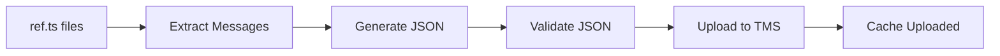
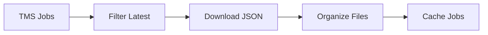

# Red Hat Developer Hub - Internationalization (i18n) Scripts

This directory contains scripts for managing translation workflows with **TMS (Translation Management System)** for the Red Hat Developer Hub project.

## 📁 Repository Structure

This i18n workflow handles translations for:

```
rhdh/scripts/i18n-scripts/           # Handles rhdh + community-plugins
```

### **Why This Approach?**

- **Post-processing**: Easy JSON → TypeScript conversion workflow
- **Comparison workflow**: Simple to compare downloaded translations with existing ones
- **Clean organization**: Repository-specific translations stay organized
- **Flexible deployment**: Deploy to appropriate locations in your projects

## 🚀 Quick Start

```bash
# Upload English source strings to TMS
yarn i18n-upload

# Download completed translations
yarn i18n-download

# Get help
yarn i18n-upload:help
yarn i18n-download:help
```

## 📋 Configuration

### **Environment Setup**

First, configure your TMS credentials:

```bash
# Add to ~/.bashrc or ~/.zshrc
export MEMSOURCE_USERNAME="your-username"
export MEMSOURCE_TOKEN="your-api-token"

# Source TMS CLI configuration
source ~/.memsourcerc  # Contains TMS connection details
```

### **Script Configuration**

Edit [`i18n.config.sh`](./i18n.config.sh) to customize:

```bash
# Release version
RHDH_RELEASE="${RHDH_RELEASE:-1.8}"

# TMS Project ID
TMS_PROJECT_ID="${TMS_PROJECT_ID:-33299484}"

# Target languages for download
DOWNLOAD_LANGS="${DOWNLOAD_LANGS:-fr}"

# File organization strategy
ORGANIZE_BY="${ORGANIZE_BY:-by-language}"  # community-plugins/plugin-name/, rhdh/ flat
```

## 🔄 Workflow Overview

### **1. Upload Workflow**



**Processes:**
- **rhdh repository**: TypeScript translation references
- **community-plugins repository**: Plugin translation files  
- **Generates**: English JSON files for TMS upload
- **Caching**: Prevents re-uploading unchanged files

### **2. Download Workflow**



**Processes:**
- **Latest-only**: Automatically selects newest translation for each file
- **Organization**: Groups by repository and plugin
- **Caching**: Prevents re-downloading completed jobs

## 📂 File Organization

### **Upload (Staging)**

```
rhdh/ui-i18n/1.8/
├── rhdh__packages__app__src__translations__ref-en.json
├── rhdh__packages__backend__src__translations__ref-en.json
└── community-plugins__workspaces__bulk-import__plugins__bulk-import__src__translations__ref-en.json
```

### **Download (Organized)**

```
rhdh/ui-i18n-downloads/1.8/
├── community-plugins/
│   ├── bulk-import/
│   │   └── community-plugins__workspaces__bulk-import__...ref-en-fr-C.json
│   └── lighthouse/
│       └── community-plugins__workspaces__lighthouse__...ref-en-es-C.json
└── rhdh/
    ├── rhdh__packages__app__...ref-en-fr-C.json
    └── rhdh__packages__backend__...ref-en-de-C.json
```

## 🛠️ Available Scripts

### **Upload Scripts**

#### `collect-and-upload.sh` - Main Upload Orchestrator

```bash
# Basic usage
./collect-and-upload.sh

# With overrides
./collect-and-upload.sh -r 1.9 -s 3280 -t 'fr,es,de'

# Environment variable + cleanup
CLEAN_AFTER_UPLOAD=1 ./collect-and-upload.sh
```

**Options:**
- `-r, --release VERSION`: RHDH release version
- `-s, --sprint NUMBER`: Sprint number for TMS
- `-p, --project-id ID`: TMS project ID override
- `-t, --target-langs LANGS`: Target languages (comma-separated)

#### `memsource-upload.sh` - TMS Upload Wrapper

Lower-level script called by the main orchestrator.

### **Download Scripts**

#### `collect-and-download.sh` - Main Download Orchestrator

```bash
# Download all completed French translations
./collect-and-download.sh

# Multiple languages
./collect-and-download.sh --languages fr,es,de,ja

# Specific job ID
./collect-and-download.sh pMeeU5JfqcECe9DAqP8AA3

# Dry run (preview)
./collect-and-download.sh --dry-run
```

**Options:**
- `--project-id ID`: Override TMS project ID
- `--languages LANGS`: Target languages (comma-separated)
- `--status STATUS`: Job status filter (COMPLETED, NEW, etc.)
- `--organize-by TYPE`: File organization (`flat`, `by-language`)
- `--output-dir DIR`: Custom output directory
- `--dry-run`: Preview mode (no actual downloads)
- `--clean-before`: Remove existing download directory

#### `memsource-download.sh` - TMS Download Wrapper

Lower-level script for TMS CLI operations.

### **Utility Scripts**

#### `extract-ts-messages.mjs` - TypeScript Message Extractor

Extracts i18n messages from TypeScript `ref.ts` files and converts them to JSON format for TMS upload.

## 🎯 Use Cases

### **1. Regular Translation Cycle**

```bash
# 1. Upload new/updated source strings
yarn i18n-upload

# 2. Wait for translators to complete work in TMS
# ...

# 3. Download completed translations
yarn i18n-download

# 4. Process downloaded JSON files
#    - Convert to TypeScript (.ts files)
#    - Compare with existing translations
#    - Replace inaccurate/outdated ones
```

### **2. Specific Language Release**

```bash
# Download only specific languages
yarn i18n-download --languages fr,es,de

# Organize in flat structure for processing
yarn i18n-download --organize-by flat
```

### **3. Development & Testing**

```bash
# Preview what would be downloaded
yarn i18n-download --dry-run

# Upload with cleanup
CLEAN_AFTER_UPLOAD=1 yarn i18n-upload
```

## 🗂️ Caching Strategy

### **Upload Cache** (`.ui-i18n-cache/`)
- **Purpose**: Prevent re-uploading unchanged JSON files
- **Key**: SHA256 hash of file contents
- **Behavior**: Only cache after successful upload

### **Download Cache** (`.ui-i18n-download-cache/`)
- **Purpose**: Prevent re-downloading completed jobs
- **Key**: TMS job ID
- **Behavior**: Tracks processed job IDs with metadata

Both caches are organized by release version (`1.8/`, `1.9/`, etc.).

## 🚨 Troubleshooting

### **Common Issues**

#### **Upload Fails: "memsource not found"**
```bash
# Source TMS CLI configuration
source ~/.memsourcerc
```

#### **Upload Fails: "Project not found"**
```bash
# Verify project ID
memsource project list --name "Red Hat Developer Hub 1.8"
```

#### **TypeScript Extraction Fails**
```bash
# Ensure TypeScript is installed
yarn add -D typescript
```

#### **Cache Issues**
```bash
# Clear upload cache
rm -rf .ui-i18n-cache/

# Clear download cache  
rm -rf .ui-i18n-download-cache/
```

### **Debug Mode**

```bash
# Dry run to see what would happen
./collect-and-download.sh --dry-run

# Check TMS jobs
memsource job list --project-id 33299484

# Validate JSON files
find ui-i18n/1.8/ -name "*.json" -exec jq . {} \;
```

## 🔗 Related

- **TMS Platform**: [Phrase TMS (Memsource)](https://cloud.memsource.com/web)
- **Backstage i18n Guide**: [Internationalization](https://backstage.io/docs/plugins/internationalization)

---

📝 **Last Updated**: September 2024  
🔧 **Maintainer**: RHDH Team
